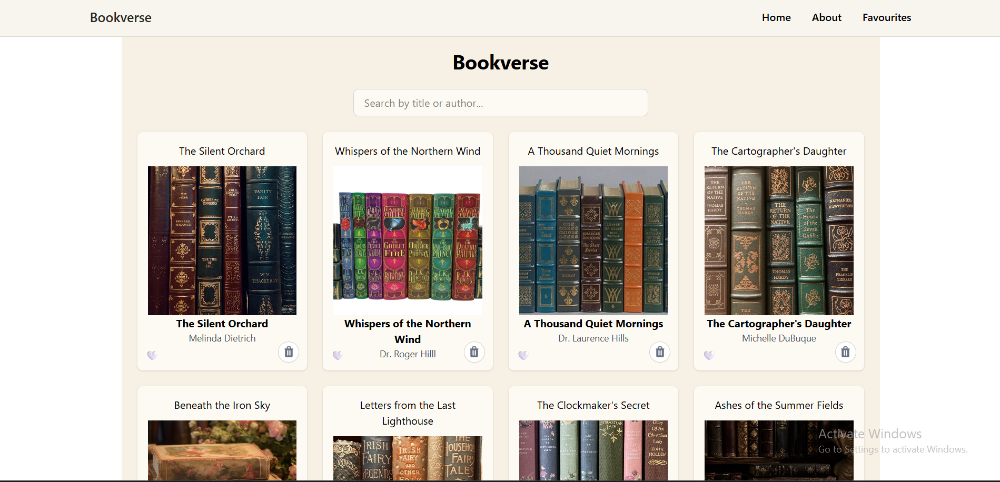
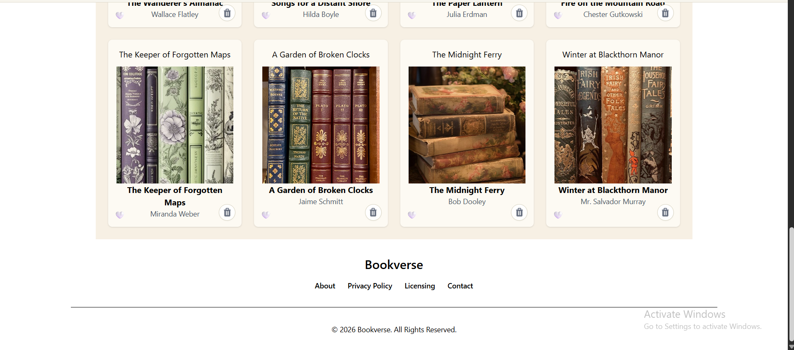
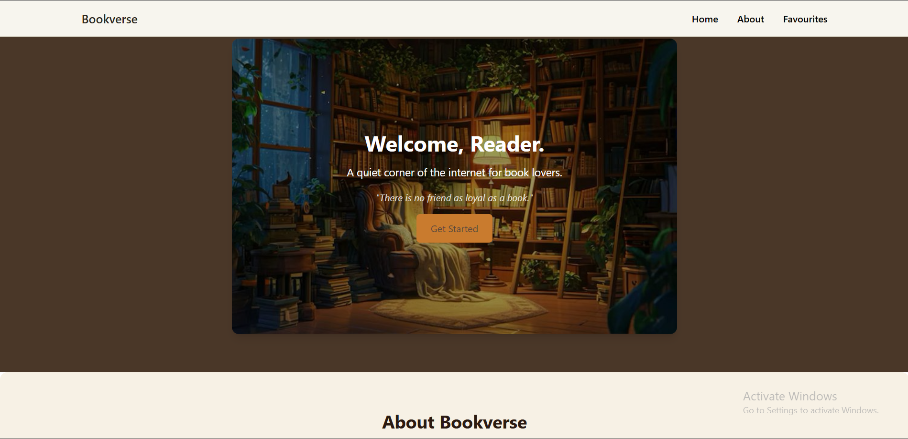
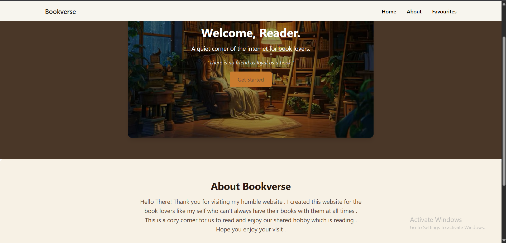
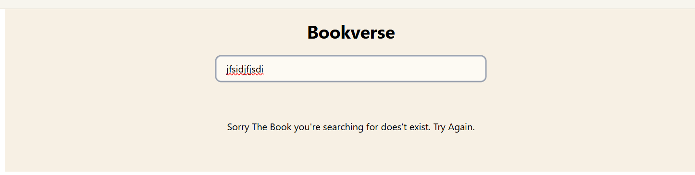
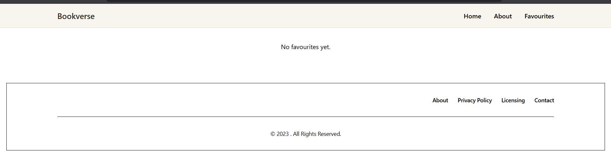
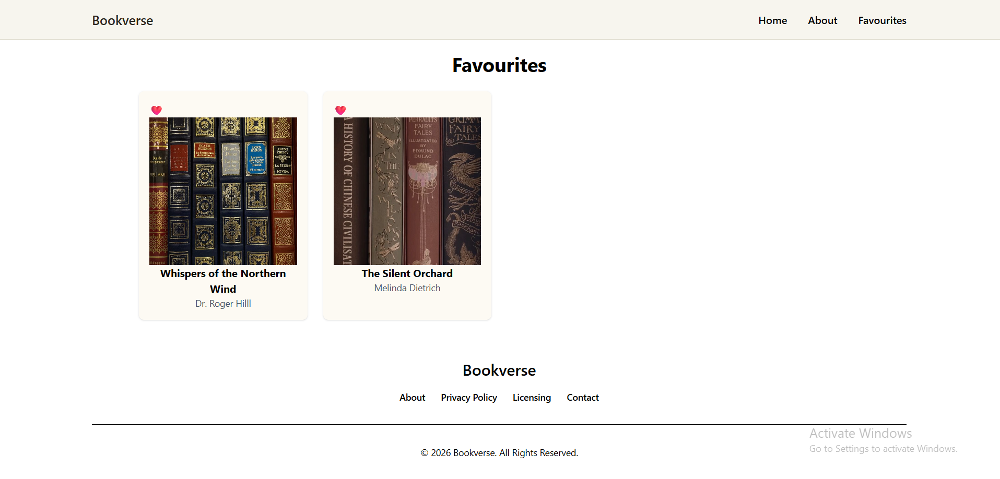
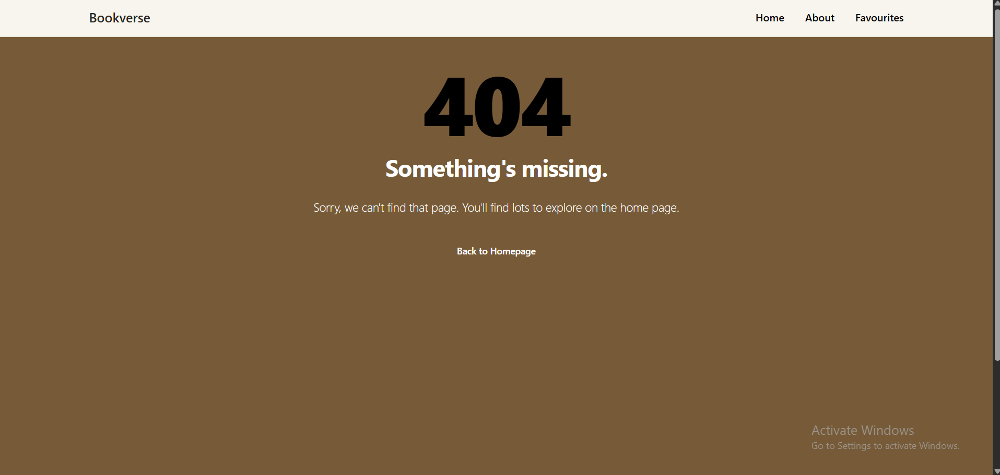
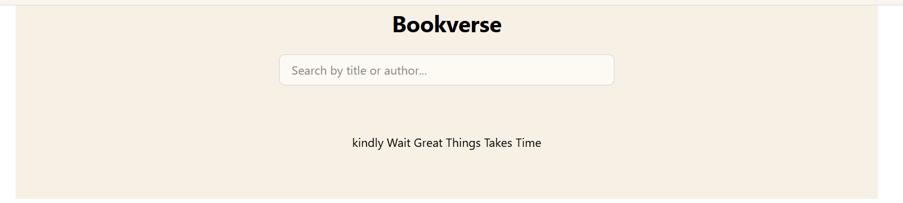

# 📚 Bookverse

> *A cozy corner of the internet for book lovers.*

A minimalist, warm-toned book browsing app — search titles, save favourites, and enjoy a calm little reading nook, right in your browser.







## 🌟 Highlights

- 🔎 **Search as you type** — instantly filter books by title or author
- ❤️ **Favourites** — save the books you love with one click, view them anytime
- 🗑️ **Remove books** — clean up your view with a single tap
- 📱 **Fully responsive** — looks great on phone, tablet, or desktop
- 🎨 **Cozy, custom design** — warm cream & brown palette, built with Tailwind CSS
- ⚡ **Fast & simple** — powered by Vite, React, and Zustand

## ℹ️ Overview

Bookverse is a small React app built for readers who want a calm, clutter-free place to browse books and keep track of favourites. It pulls book data from the [Bookstore Fake API](https://bookstore-api-six.vercel.app/), pairs it with hand-picked titles and cover art for a more polished feel, and wraps it all in a soft, reading-nook aesthetic instead of a typical harsh e-commerce look.

### ✍️ Author

Built as a React iti grad project.

## 🚀 Usage

Browse books on the Home page, search by typing in the search bar, and tap the heart to save a favourite — view all your saved books anytime on the Favourites page.




## ⬇️ Installation

```bash
git clone https://github.com/yasso2005/ITI_grad-project
cd bookverse
npm install
npm run dev
```

Requires [Node.js](https://nodejs.org/) installed. The app runs at `http://localhost:5173`.

## 📸 Screenshots

| Home | About | Favourites | 404 | search | loading |
|---|---|---|---|---|---|
|  |  |  |  |  |


## 🛠️ Built With

- **React** (Vite) + **React Router** for routing
- **Zustand** for state management
- **Axios** for data fetching
- **Tailwind CSS** + **Flowbite** for styling
- **[Bookstore Fake API](https://bookstore-api-six.vercel.app/)** for book data

## 📄 License

This project is for educational purposes.